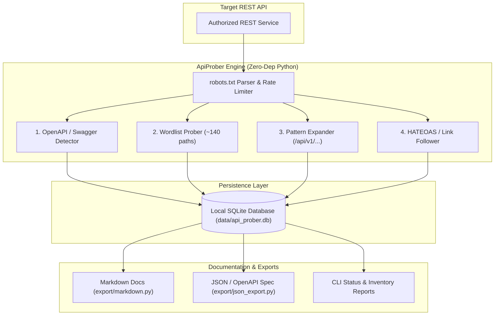
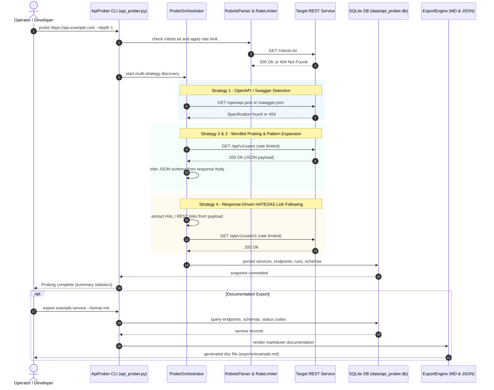

<p align="center">
  
</p>

<p align="right">
  <a href="README_de.md">🇩🇪 Deutsch</a> | <b>🇬🇧 English</b>
</p>

# ApiProber -- Passive API Discovery and Documentation Tool

[](https://github.com/dev-bricks/ApiProber/actions/workflows/tests.yml)
[](https://www.python.org/)
[](https://docs.pytest.org/)
[]()
[](LICENSE)
[](llms.txt)
[](https://github.com/dev-bricks)
[](https://github.com/open-bricks)

ApiProber is a zero-dependency, local-first Python CLI for ethical, passive REST API surface discovery. It assists developers, maintainers, and security auditors in mapping undocumented REST services, auto-detecting OpenAPI/Swagger specifications, crawling HATEOAS links, inferring JSON schemas from live responses, persisting observations in a local SQLite database, and exporting clean Markdown or OpenAPI-compatible JSON documentation.

> [!NOTE]
> **Passive & Ethical API Reconnaissance:** ApiProber is a zero-dependency local-first Python CLI designed exclusively for authorized passive REST API surface discovery and documentation generation. It operates with strict rate limiting, respects `robots.txt`, and uses no aggressive fuzzing or destructive methods.

> [!TIP]
> **LLM / RAG Context Available:** A structured, LLM-optimized index of this repository is maintained in [`llms.txt`](llms.txt) for AI assistants and context windows.

**Author:** Lukas Geiger | **License:** MIT | **Python:** 3.8+ (stdlib only) | **Invariants:** Level 1 SBOM (`INV-LOCAL-01` to `INV-SLA-10`)

---

## Quick Navigation

| Section | Link (English) | Sprachwechsel (Deutsch) |
|---|---|---|
| **01. Start Here** | [Start Here](#sec-01) | [🇩🇪 Schnellstart](README_de.md#sec-01) |
| **02. Target Personas & Best Fit** | [Target Personas](#sec-02) | [🇩🇪 Zielgruppen](README_de.md#sec-02) |
| **03. High-Intent Search Queries** | [Search Intent](#sec-03) | [🇩🇪 Suchanfragen & SEO](README_de.md#sec-03) |
| **04. Core Features & Invariants** | [Core Features](#sec-04) | [🇩🇪 Kernfunktionen & Garantien](README_de.md#sec-04) |
| **05. Comparative Matrix (10x5)** | [Comparative Matrix](#sec-05) | [🇩🇪 Vergleichsmatrix](README_de.md#sec-05) |
| **06. Architectural Topology** | [System Topology](#sec-06) | [🇩🇪 Systemarchitektur](README_de.md#sec-06) |
| **07. Probing Sequence Flow** | [Sequence Diagram](#sec-07) | [🇩🇪 Sequenzablauf](README_de.md#sec-07) |
| **08. Multi-Strategy Discovery Engine** | [Discovery Strategies](#sec-08) | [🇩🇪 Erkennungsstrategien](README_de.md#sec-08) |
| **09. Installation & Setup** | [Installation](#sec-09) | [🇩🇪 Installation](README_de.md#sec-09) |
| **10. CLI Usage & Commands** | [CLI Reference](#sec-10) | [🇩🇪 Befehlsreferenz](README_de.md#sec-10) |
| **11. Credential Safety & Storage** | [Credential Safety](#sec-11) | [🇩🇪 Anmeldedaten & Sicherheit](README_de.md#sec-11) |
| **12. Schema Inference & SQLite** | [Schema Inference](#sec-12) | [🇩🇪 Schema-Inferenz & SQLite](README_de.md#sec-12) |
| **13. Markdown & JSON Export** | [Export Formats](#sec-13) | [🇩🇪 Export-Formate](README_de.md#sec-13) |
| **14. Project Structure** | [Project Structure](#sec-14) | [🇩🇪 Projektstruktur](README_de.md#sec-14) |
| **15. Level 1 SBOM & Licenses** | [SBOM & Licenses](#sec-15) | [🇩🇪 SBOM & Lizenzen](README_de.md#sec-15) |
| **16. Security Policy & 48h SLA** | [Security Policy](#sec-16) | [🇩🇪 Sicherheitsrichtlinie](README_de.md#sec-16) |
| **17. Development & Tests** | [Development](#sec-17) | [🇩🇪 Entwicklung & Tests](README_de.md#sec-17) |
| **18. Legal Notice & § 521 BGB** | [Liability Disclaimer](#sec-18) | [🇩🇪 Haftungsausschluss](README_de.md#sec-18) |

---

<a id="sec-01"></a>
## 01. Start Here

| Goal | Command or File | Description |
|---|---|---|
| **CLI Help & Flags** | `python api_prober.py --help` | View all available subcommands and flags |
| **Map an Authorized API** | `python api_prober.py probe <base-url>` | Run multi-strategy passive discovery against a target |
| **Inspect Stored Services** | `python api_prober.py list` | List all discovered API services stored in SQLite |
| **Export Documentation** | `python api_prober.py export <service> --format md` | Generate clean Markdown API documentation |
| **Export OpenAPI JSON** | `python api_prober.py export <service> --format json` | Generate OpenAPI-compatible JSON schema catalogue |
| **Read Machine Context** | [`llms.txt`](llms.txt) | LLM-optimized index for RAG and AI assistants |
| **Report a Vulnerability** | [`SECURITY.md`](SECURITY.md) | Private vulnerability disclosure via GitHub Advisories |

---

<a id="sec-02"></a>
## 02. Target Personas & Best Fit

- **`[PERSONA-01]` Backend & Integration Engineers:** Inheriting legacy REST microservices with missing or outdated Swagger/OpenAPI specifications, needing a fast, non-destructive way to map out all active routes and schemas.
- **`[PERSONA-02]` DevOps & Platform SREs:** Auditing internal service meshes and compliance boundaries in staging/air-gapped environments without installing heavy runtimes (pure Python 3.8+ stdlib).
- **`[PERSONA-03]` Security Reviewers & QA Auditors:** Performing authorized, rate-limited passive reconnaissance and documentation verification without triggering WAF tripwires or running invasive fuzzers.
- **`[PERSONA-04]` Technical Writers & API Product Managers:** Generating baseline Markdown and JSON API catalogs directly from live staging endpoints to bootstrap documentation repositories.

### Best Fit Scenarios
- Internal REST services where no OpenAPI file exists or the specification drifted
- Legacy APIs that need lightweight, repeatable endpoint inventory documentation
- Documentation audits comparing live API behavior with expected routes
- Local-first reconnaissance before authoring custom client SDKs
- Passive security reviews with explicit customer or organizational authorization

> [!CAUTION]
> ApiProber is **not** an exploit framework, vulnerability scanner, load tester, or brute-force fuzzer. It operates strictly with gentle rate limits and respects `robots.txt`. Use it only on APIs you own or are explicitly authorized to assess.

---

<a id="sec-03"></a>
## 03. High-Intent Search Queries & Discoverability

ApiProber is indexed and discoverable for developer and engineering searches:
- `passive rest api discovery python tool`
- `undocumented api endpoint documentation generator`
- `zero dependency python api reconnaissance sqlite`
- `automate openapi swagger detection legacy rest service`
- `rate limited ethical api prober robots.txt compliance`
- `infer json schema from rest api responses python`
- `offline local first api mapping CLI`
- `hateoas rest api crawler python stdlib`

---

<a id="sec-04"></a>
## 04. Core Features & System Invariants

- **Multi-Strategy Discovery:** OpenAPI/Swagger detection, wordlist probing (~140 paths), pattern expansion, and HATEOAS response link following.
- **Strict Rate Limiting:** Configurable inter-request delay (default: 500 ms) preventing service disruption.
- **robots.txt Compliance:** Automatic extraction and adherence to target access restrictions.
- **Credential Safety:** Supports Bearer tokens, API keys, and Basic auth; secrets are kept out of CLI process tables, redacted in SQLite, and excluded from exports.
- **JSON Schema Extraction:** Automatic inference of data types, nested structures, and required fields from live response payloads.
- **SQLite Persistence:** Atomic, local storage of all discovery runs, endpoints, and schemas (`data/api_prober.db`).
- **Dual Export Engine:** One-command generation of human-readable Markdown docs or machine-readable JSON (OpenAPI-like).
- **Session Resumption:** Continue interrupted probing sessions from the exact last state.
- **Zero Third-Party Dependencies:** 100% pure Python standard library (`urllib`, `sqlite3`, `json`, `argparse`, `pathlib`).

### Formal System Invariants

| Invariant | Category | Description | Status |
|---|---|---|---|
| **INV-LOCAL-01** | Zero Dependencies | Pure Python standard library; 0 third-party packages required | **PASS** |
| **INV-LOCAL-02** | Zero Telemetry | No analytics tracking, telemetry, or external phone-home egress | **PASS** |
| **INV-LOCAL-03** | Secret Redaction | Secrets redacted from logs, databases (`***REDACTED***`), and exports | **PASS** |
| **INV-LOCAL-04** | robots.txt Enforcement | Automatic respect for target access restrictions | **PASS** |
| **INV-LOCAL-05** | Rate-Limited Probing | Configurable delay (default 500 ms) preventing request flooding | **PASS** |
| **INV-LOCAL-06** | Read-Only Default | GET, HEAD, OPTIONS only; mutating verbs require explicit opt-in | **PASS** |
| **INV-LOCAL-07** | Unprivileged Execution | Standard unprivileged execution (`RunAsInvoker`); zero UAC elevation | **PASS** |
| **INV-LOCAL-08** | UTF-8 & Unicode | Full preservation of UTF-8, internationalized domain names, and umlauts | **PASS** |
| **INV-SLA-09** | 5-Day Triage | Vulnerability reports triaged and assessed within 5 business days | **PASS** |
| **INV-SLA-10** | 48-Hour Response SLA | Initial acknowledgment and response within 48 hours | **PASS** |

---

<a id="sec-05"></a>
## 05. 10-Dimension Comparative Matrix (5-Way)

| Technical Dimension | ApiProber | Postman / Newman | curl + Bash Scripts | OWASP ZAP / Burp | Swagger Inspector |
|---|---|---|---|---|---|
| **1. Zero Dependencies (Stdlib Only)** | **Yes (100% Python stdlib)** | No (Electron / Node.js) | Partial (curl, jq, sed) | No (Java runtime) | No (Browser / SaaS) |
| **2. Local-First Offline Persistence** | **Yes (SQLite DB)** | Cloud-first / Sync | Manual (raw text dumps) | HSQLDB / Session files | Cloud session only |
| **3. Automated OpenAPI Detection** | **Yes (Priority 1 auto-detect)** | Manual import | Manual scripting | Via add-on / spider | Manual URL input |
| **4. Multi-Strategy REST Wordlists** | **Yes (~140 paths + patterns)** | No (Manual collections) | Requires custom loops | Active fuzzing / spiders | No |
| **5. HATEOAS Link Crawling** | **Yes (Automated JSON links)** | No (Manual chaining) | Complex scripting | DOM/HTML crawler | No |
| **6. Automated Schema Inference** | **Yes (Types & nested objects)** | No (Manual asserts) | No (Manual jq rules) | No | Partial (Draft spec) |
| **7. Ethical & Rate-Limited Default** | **Yes (robots.txt + 500ms delay)**| No built-in rate limit | Manual `sleep` | Aggressive scanning | Manual single calls |
| **8. Credential Safety & Redaction** | **Strict (Argv prompt + DB redacted)** | Vault / Env vars | Leaks in shell history | Stored in session | Browser memory |
| **9. Markdown & JSON Documentation** | **Yes (One-click MD & JSON)** | Collection JSON only | Custom template needed | Vulnerability report | OpenAPI spec only |
| **10. Zero Telemetry / Egress** | **Yes (100% private, zero egress)**| SaaS telemetry | Yes (No telemetry) | Update checks | SaaS analytics |

---

<a id="sec-06"></a>
## 06. Architectural Topology



---

<a id="sec-07"></a>
## 07. Probing Sequence Flow

The following sequence details how ApiProber verifies `robots.txt`, applies inter-request rate limiting, coordinates discovery strategies, infers response schemas, and exports documentation without emitting external telemetry:



---

<a id="sec-08"></a>
## 08. Multi-Strategy Discovery Engine

ApiProber orchestrates discovery using four specialized strategies executed in descending order of efficiency:

1. **OpenAPI Detection (Priority 1):** Scans for `/swagger.json`, `/openapi.json`, `/api-docs`, `/v3/api-docs`, and Swagger UI assets. If found, the entire official specification is ingested directly.
2. **Wordlist Probing (Priority 2):** Tests ~140 curated endpoint paths spanning core REST resources, authentication endpoints, and administrative interfaces.
3. **Pattern Expansion (Priority 3):** Generates and tests common versioning structures such as `/api/v{1,2,3}/{resource}` and `/rest/{resource}`.
4. **Response-Driven / HATEOAS (Priority 4):** Parses JSON responses, extracts hypermedia links (HAL, JSON-LD, navigation links), and schedules newly discovered URIs for exploration within depth limits.

---

<a id="sec-09"></a>
## 09. Installation & Zero-Dependency Setup

No external package installation is required. ApiProber runs natively on any standard Python 3.8+ runtime.

```bash
# Clone the repository
git clone https://github.com/dev-bricks/ApiProber.git
cd ApiProber

# Run directly via Python
python api_prober.py --help

# Or install in editable mode for the CLI entry point
pip install -e .
apiprober --help
```

---

<a id="sec-10"></a>
## 10. CLI Usage & Command Reference

### Probing an API

```bash
# Basic probe against an authorized service
python api_prober.py probe https://jsonplaceholder.typicode.com

# Deep probe (depth 2) with a conservative 1-second delay
python api_prober.py probe https://api.example.com --depth 2 --delay-ms 1000

# Authenticated probe using an interactive prompt (keeps token out of ps args)
python api_prober.py probe https://api.example.com --auth-type bearer --auth-prompt
```

### Managing Discovered Services

```bash
# List all tracked services in local SQLite
python api_prober.py list

# View detailed status and endpoints for a specific service
python api_prober.py status jsonplaceholder

# Resume an interrupted session
python api_prober.py resume jsonplaceholder
```

### Exporting Documentation

```bash
# Export as clean Markdown documentation
python api_prober.py export jsonplaceholder --format md

# Export as OpenAPI-compatible JSON schema
python api_prober.py export jsonplaceholder --format json
```

### Configuration Management

```bash
# Show active configuration (secrets automatically redacted)
python api_prober.py config --show

# Update rate limit delay
python api_prober.py config --set delay_ms 1000

# Update authentication type
python api_prober.py config --set auth.type bearer
```

---

<a id="sec-11"></a>
## 11. Credential Handling & Secret Safety

ApiProber is architected to prevent accidental credential leakage in shell history, process tables, version control, and exported files:

- **Environment Variables (Recommended):** Set `APIPROBER_AUTH_VALUE` and optionally `APIPROBER_AUTH_TYPE`. These take highest precedence and are never written to disk.
- **Interactive Prompt:** Use `--auth-prompt` for one-off sessions. For persistent storage, `python api_prober.py config --set-auth` prompts securely and writes exclusively to the gitignored `config.local.json`.
- **Argv Rejection:** Legacy secret flags in command arguments (`--auth-value TOKEN`) are rejected with an error without echoing the token.
- **Redacted Outputs:** `config --show` always prints `***REDACTED***` for secrets.
- **Database Safety:** SQLite probe run records redact credentials. When sessions are resumed with `resume`, credentials are re-read from current environment variables or `config.local.json`.
- **Cross-Origin Stripping:** If an API target redirects across domains, configured authorization headers are stripped automatically.

---

<a id="sec-12"></a>
## 12. JSON Schema Extraction & SQLite Persistence

When probing active REST endpoints, ApiProber inspects JSON response payloads and infers structural schemas:
- Detects primitive types (`string`, `integer`, `number`, `boolean`, `null`)
- Maps nested object hierarchies and array member types
- Identifies required vs. nullable keys across multiple samples
- Persists all observations atomically into `data/api_prober.db`

---

<a id="sec-13"></a>
## 13. Documentation Export (Markdown & JSON)

Generated documentation is written directly to `exports/`:
- **Markdown (`.md`):** Complete human-readable API catalog with tables of endpoints, HTTP methods, inferred schemas, and status codes.
- **JSON (`.json`):** OpenAPI-like specification ready for downstream integration into mock servers, SDK generators, or API gateways.

---

<a id="sec-14"></a>
## 14. Project Structure

```
ApiProber/
+-- api_prober.py            CLI entry point & argument parser
+-- config.json              Default configuration (no secrets)
+-- config.local.json        Local overrides incl. auth.value (gitignored)
+-- core/                    Core architectural modules
|   +-- config.py            Configuration loading & resolution
|   +-- database.py          SQLite persistence layer
|   +-- http_client.py       HTTP client with rate limiting & redirection safety
|   +-- robots.py            robots.txt parsing & rule enforcement
|   +-- schema_extractor.py  JSON response schema inference
+-- discovery/               Multi-strategy discovery engine
|   +-- orchestrator.py      Discovery coordinator
|   +-- openapi_detect.py    OpenAPI/Swagger autodetection
|   +-- wordlist.py          Wordlist-driven probing
|   +-- pattern.py           URI pattern expansion
|   +-- response_driven.py   HATEOAS link crawler
|   +-- method_tester.py     HTTP method verification
+-- export/                  Export generators
|   +-- json_export.py       OpenAPI-like JSON catalog
|   +-- markdown.py          Markdown documentation renderer
+-- wordlists/               Curated REST path dictionaries (~140 paths)
|   +-- common_rest.txt      General REST resources
|   +-- admin_paths.txt      Management & diagnostic routes
|   +-- auth_endpoints.txt   Authentication & token endpoints
|   +-- swagger_paths.txt    OpenAPI/Swagger spec paths
+-- data/                    Runtime SQLite database (gitignored)
+-- exports/                 Exported documentation files (gitignored)
+-- tests/                   Automated contract & hygiene test suite
+-- NOTICE                   Attribution & 10 formal system invariants
+-- THIRD_PARTY_LICENSES.md  Level 1 SBOM & license attributions
```

---

<a id="sec-15"></a>
## 15. Level 1 SBOM & Software Bill of Materials

ApiProber guarantees a clean, unencumbered open-source supply chain:
- **Zero Third-Party Runtime Dependencies:** 100% Python standard library (`PSF-2.0`).
- **Unprivileged Execution:** Standard `RunAsInvoker` mode with zero UAC elevation.
- **Zero Copyleft Contagion:** All discovered API schemas, databases, and Markdown exports belong 100% to the operator.
- Full details documented in [`THIRD_PARTY_LICENSES.md`](THIRD_PARTY_LICENSES.md) and [`NOTICE`](NOTICE).

---

<a id="sec-16"></a>
## 16. Security Policy & 48h Response SLA

We take security and responsible disclosure seriously:
- **48-Hour Response SLA (`INV-SLA-10`):** Initial response and acknowledgment within 48 hours.
- **5-Day Vulnerability Triage (`INV-SLA-09`):** Full reproducibility assessment and remediation plan within 5 business days.
- **Private Reporting:** Submit reports privately via [GitHub Security Advisories](https://github.com/dev-bricks/ApiProber/security/advisories/new).
- See complete details in [`SECURITY.md`](SECURITY.md).

---

<a id="sec-17"></a>
## 17. Development & Regression Test Suite

Run the automated contract and regression test suite locally:

```bash
# Run unit, security, and contract hygiene tests
python -m pytest -q

# Verify syntax across all modules
python -m compileall -q .

# Optional: Run live test against jsonplaceholder (opt-in)
set APIPROBER_RUN_NETWORK_TESTS=1
python -m pytest -q test_smoke.py
```

---

<a id="sec-18"></a>
## 18. Legal Notice & § 521 BGB Statutory Disclaimer

Dieses Projekt ist eine **unentgeltliche Open-Source-Schenkung** im Sinne der §§ 516 ff. BGB. Die Haftung des Urhebers ist gemäß **§ 521 BGB** auf **Vorsatz und grobe Fahrlässigkeit** beschränkt. Ergänzend gelten die Haftungsausschlüsse aus der MIT-Lizenz.

Nutzung auf eigenes Risiko. Keine Wartungszusage, keine Verfügbarkeitsgarantie, keine Gewähr für Fehlerfreiheit oder Eignung für einen bestimmten Zweck.

This project is an unpaid open-source donation. Liability is limited to intent and gross negligence (§ 521 German Civil Code). Use at your own risk. No warranty, no maintenance guarantee, no fitness-for-purpose assumed.

---

**Author:** Lukas Geiger -- [github.com/lukisch](https://github.com/lukisch)  
**Repository:** [dev-bricks/ApiProber](https://github.com/dev-bricks/ApiProber)  
**Umbrella Ecosystem:** [open-bricks](https://github.com/open-bricks)
