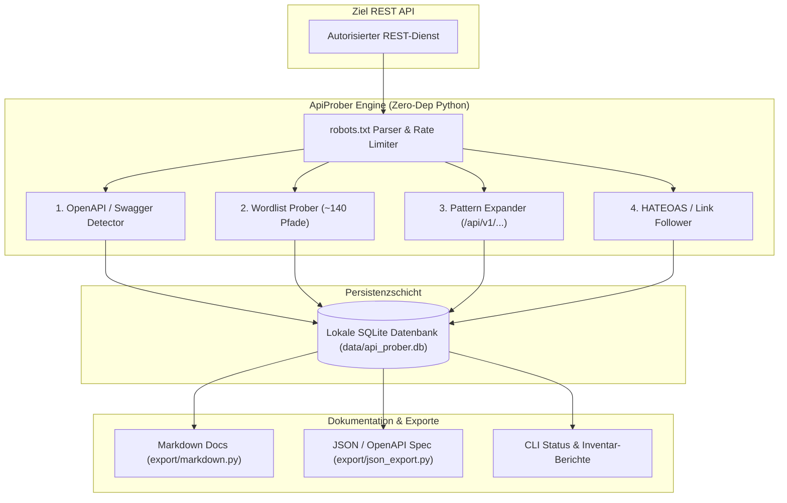
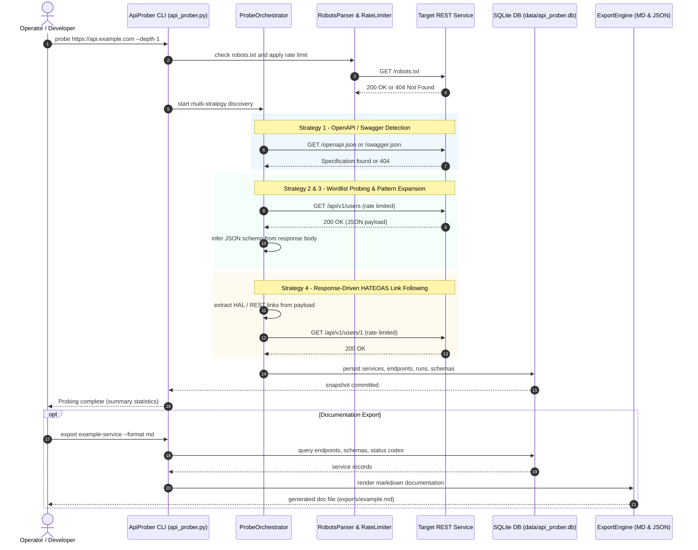

<p align="center">
  
</p>

<p align="right">
  <b>🇩🇪 Deutsch</b> | <a href="README.md">🇬🇧 English</a>
</p>

# ApiProber -- Passives API-Discovery- und Dokumentations-Tool

[](https://github.com/dev-bricks/ApiProber/actions/workflows/tests.yml)
[](https://www.python.org/)
[](https://docs.pytest.org/)
[]()
[](LICENSE)
[](llms.txt)
[](https://github.com/dev-bricks)
[](https://github.com/open-bricks)

ApiProber ist ein abhängigkeitsfreies Local-First Python-CLI für das ethische, passive Erkunden und Dokumentieren von REST-API-Oberflächen. Es unterstützt Entwickler, DevOps-Teams und Sicherheitsprüfer dabei, undokumentierte REST-Dienste zu kartografieren, vorhandene OpenAPI/Swagger-Spezifikationen automatisch zu identifizieren, HATEOAS-Links zu verfolgen, JSON-Schemata aus Antworten abzuleiten, Daten lokal in SQLite zu persistieren und saubere Markdown- oder OpenAPI-kompatible JSON-Dokumentationen zu generieren.

> [!NOTE]
> **Passives & Ethisches API-Probing:** ApiProber ist ein abhängigkeitsfreies Local-First Python CLI, das ausschließlich für die autorisierte passive REST-API-Oberflächenerkennung und Dokumentationsgenerierung entwickelt wurde. Es arbeitet mit striktem Rate-Limiting, beachtet `robots.txt` und nutzt keinerlei Fuzzing oder destruktive Methoden.

> [!TIP]
> **LLM / RAG Kontext verfügbar:** Ein strukturierter, für LLMs optimierter Index dieses Repositories wird in [`llms.txt`](llms.txt) für KI-Assistenten und Kontextfenster bereitgestellt.

**Autor:** Lukas Geiger | **Lizenz:** MIT | **Python:** 3.8+ (nur Standardbibliothek) | **Garantien:** Level 1 SBOM (`INV-LOCAL-01` bis `INV-SLA-10`)

---

## Schnellnavigation

| Abschnitt | Link (Deutsch) | Language Switch (English) |
|---|---|---|
| **01. Schnellstart** | [Schnellstart](#sec-01) | [🇬🇧 Start Here](README.md#sec-01) |
| **02. Zielgruppen & Einsatzbereiche** | [Zielgruppen](#sec-02) | [🇬🇧 Target Personas](README.md#sec-02) |
| **03. Suchanfragen & SEO** | [Suchanfragen & SEO](#sec-03) | [🇬🇧 Search Intent](README.md#sec-03) |
| **04. Kernfunktionen & Garantien** | [Kernfunktionen](#sec-04) | [🇬🇧 Core Features](README.md#sec-04) |
| **05. Vergleichsmatrix (10x5)** | [Vergleichsmatrix](#sec-05) | [🇬🇧 Comparative Matrix](README.md#sec-05) |
| **06. Systemarchitektur** | [Systemarchitektur](#sec-06) | [🇬🇧 System Topology](README.md#sec-06) |
| **07. Sequenzablauf** | [Sequenzdiagramm](#sec-07) | [🇬🇧 Sequence Diagram](README.md#sec-07) |
| **08. Multi-Strategie-Erkennung** | [Erkennungsstrategien](#sec-08) | [🇬🇧 Discovery Strategies](README.md#sec-08) |
| **09. Installation & Setup** | [Installation](#sec-09) | [🇬🇧 Installation](README.md#sec-09) |
| **10. CLI-Befehlsreferenz** | [Befehlsreferenz](#sec-10) | [🇬🇧 CLI Reference](README.md#sec-10) |
| **11. Anmeldedaten & Sicherheit** | [Anmeldedaten](#sec-11) | [🇬🇧 Credential Safety](README.md#sec-11) |
| **12. Schema-Inferenz & SQLite** | [Schema-Inferenz](#sec-12) | [🇬🇧 Schema Inference](README.md#sec-12) |
| **13. Export-Formate (MD & JSON)** | [Export-Formate](#sec-13) | [🇬🇧 Export Formats](README.md#sec-13) |
| **14. Projektstruktur** | [Projektstruktur](#sec-14) | [🇬🇧 Project Structure](README.md#sec-14) |
| **15. Level 1 SBOM & Lizenzen** | [SBOM & Lizenzen](#sec-15) | [🇬🇧 SBOM & Licenses](README.md#sec-15) |
| **16. Sicherheitsrichtlinie & 48h-SLA** | [Sicherheitsrichtlinie](#sec-16) | [🇬🇧 Security Policy](README.md#sec-16) |
| **17. Entwicklung & Tests** | [Entwicklung & Tests](#sec-17) | [🇬🇧 Development](README.md#sec-17) |
| **18. Haftungsausschluss & § 521 BGB** | [Haftungsausschluss](#sec-18) | [🇬🇧 Liability Disclaimer](README.md#sec-18) |

---

<a id="sec-01"></a>
## 01. Schnellstart

| Ziel | Befehl oder Datei | Beschreibung |
|---|---|---|
| **CLI-Hilfe & Optionen** | `python api_prober.py --help` | Alle verfügbaren Befehle und Parameter anzeigen |
| **Autorisierte API untersuchen** | `python api_prober.py probe <base-url>` | Multi-Strategie-Sondierung gegen ein autorisiertes Ziel starten |
| **Gespeicherte Dienste anzeigen** | `python api_prober.py list` | Alle in SQLite erfassten API-Dienste auflisten |
| **Dokumentation exportieren** | `python api_prober.py export <service> --format md` | Lesbare Markdown-API-Dokumentation erzeugen |
| **OpenAPI-JSON exportieren** | `python api_prober.py export <service> --format json` | OpenAPI-kompatiblen JSON-Schema-Katalog generieren |
| **Maschinenlesbarer Kontext** | [`llms.txt`](llms.txt) | LLM-optimierter Index für RAG und KI-Assistenten |
| **Schwachstelle vertraulich melden** | [`SECURITY.md`](SECURITY.md) | Private Sicherheitsmeldung via GitHub Advisories |

---

<a id="sec-02"></a>
## 02. Zielgruppen & Einsatzbereiche

- **`[PERSONA-01]` Backend- & Integrationsentwickler:** Übernahme von Legacy-REST-Microservices ohne oder mit veralteter OpenAPI/Swagger-Dokumentation; Bedarf an einer zerstörungsfreien, schnellen Erfassung aller aktiven Routen und Datenschemata.
- **`[PERSONA-02]` DevOps & Plattform-SREs:** Auditing interner Service-Meshes und Compliance-Grenzen in Staging- oder Air-Gapped-Umgebungen ohne Installation schwerer Abhängigkeiten (reine Python 3.8+ Standardbibliothek).
- **`[PERSONA-03]` Sicherheitsprüfer & QA-Auditoren:** Durchführung autorisierter, ratenlimitierter passiver Reconnaissance und Dokumentationsabgleiche ohne Auslösen von WAF-Filtern oder Einsatz destruktiver Fuzzer.
- **`[PERSONA-04]` Technische Redakteure & API-Produktmanager:** Erstellung konsistenter Markdown- und JSON-Basiskataloge direkt aus laufenden Staging-Diensten als Fundament für Dokumentationsportale.

### Ideale Einsatzszenarien
- Interne REST-Dienste, für die keine OpenAPI-Datei existiert oder Spezifikationsdrift vorliegt
- Legacy-APIs, die eine leichtgewichtige, reproduzierbare Endpunkt-Dokumentation benötigen
- Dokumentations-Audits, bei denen das Live-Verhalten mit den erwarteten Routen verglichen werden soll
- Local-First-Sondierung vor dem Schreiben eines eigenen Clients oder SDKs
- Passive Sicherheitsüberprüfungen mit expliziter Autorisierung

> [!CAUTION]
> ApiProber ist **kein** Exploit-Framework, Schwachstellen-Scanner, Lasttester oder Brute-Force-Fuzzer. Es arbeitet strikt mit schonenden Ratenbegrenzungen und beachtet `robots.txt`. Nutzen Sie es nur für APIs, die Sie besitzen oder zu deren Überprüfung Sie ausdrücklich berechtigt sind.

---

<a id="sec-03"></a>
## 03. Suchanfragen & SEO

ApiProber ist für gezielte Entwickler- und Engineering-Suchanfragen optimiert:
- `passive rest api discovery python tool`
- `undocumented api endpoint documentation generator`
- `zero dependency python api reconnaissance sqlite`
- `automate openapi swagger detection legacy rest service`
- `rate limited ethical api prober robots.txt compliance`
- `infer json schema from rest api responses python`
- `offline local first api mapping CLI`
- `hateoas rest api crawler python stdlib`

---

<a id="sec-04"></a>
## 04. Kernfunktionen & Garantien

- **Multi-Strategie-Erkennung:** OpenAPI/Swagger-Erkennung, Wordlist-Probing (~140 Pfade), Pattern-Expansion (Mustererweiterung) und HATEOAS-Link-Verfolgung.
- **Integriertes Rate Limiting:** Konfigurierbare Verzögerung zwischen Anfragen (Standard: 500 ms) zur Vermeidung von Dienstüberlastungen.
- **robots.txt-Konformität:** Automatische Berücksichtigung und Einhaltung von Zugriffsbeschränkungen.
- **Schutz von Zugangsdaten:** Unterstützung für Bearer-Tokens, API-Keys und Basic-Auth; Geheimnisse bleiben außerhalb von Prozesstabellen, werden in SQLite redigiert und in Exporten unkenntlich gemacht.
- **JSON-Schema-Extraktion:** Automatische Inferenz von Datentypen, verschachtelten Strukturen und Pflichtfeldern aus realen API-Antworten.
- **SQLite-Persistenz:** Atomare, lokale Speicherung aller Sondierungen, Endpunkte und Schemata (`data/api_prober.db`).
- **Duale Export-Engine:** Ein-Befehl-Generierung von Markdown-Dokumentationen oder OpenAPI-ähnlichem JSON.
- **Sitzungsfortführung:** Unterbrochene Sondierungsläufe können nahtlos fortgesetzt werden.
- **Keine Drittanbieter-Abhängigkeiten:** 100% reine Python-Standardbibliothek (`urllib`, `sqlite3`, `json`, `argparse`, `pathlib`).

### Formale System-Invarianten

| Invariante | Kategorie | Beschreibung | Status |
|---|---|---|---|
| **INV-LOCAL-01** | Keine Abhängigkeiten | Reine Python-Standardbibliothek; 0 Drittanbieter-Pip-Pakete erforderlich | **BESTANDEN** |
| **INV-LOCAL-02** | Null Telemetrie | Keine Analyse-Tracker, Telemetriedaten oder Egress-Phone-Home-Mechanismen | **BESTANDEN** |
| **INV-LOCAL-03** | Geheimnis-Schutz | Zugangsdaten in Logs, Datenbanken (`***REDACTED***`) und Exporten zensiert | **BESTANDEN** |
| **INV-LOCAL-04** | robots.txt Einhaltung | Automatische Beachtung von Zugriffsbeschränkungen | **BESTANDEN** |
| **INV-LOCAL-05** | Ratenbegrenzung | Konfigurierbare Verzögerung (Standard: 500 ms) gegen Request-Flooding | **BESTANDEN** |
| **INV-LOCAL-06** | Read-Only Standard | Nur GET, HEAD, OPTIONS; schreibende Operationen erfordern explizites Opt-in | **BESTANDEN** |
| **INV-LOCAL-07** | Rechte-Minimum | Standardausführung ohne Administratorrechte (`RunAsInvoker`); keine UAC-Abfrage | **BESTANDEN** |
| **INV-LOCAL-08** | UTF-8 & Unicode | Vollständige Erhaltung von UTF-8, internationalen Domainnamen und Umlauten | **BESTANDEN** |
| **INV-SLA-09** | 5-Tage-Triage | Sicherheitsmeldungen werden innerhalb von 5 Werktagen geprüft und bewertet | **BESTANDEN** |
| **INV-SLA-10** | 48-Stunden-SLA | Erste Rückmeldung und Eingangsbestätigung innerhalb von 48 Stunden | **BESTANDEN** |

---

<a id="sec-05"></a>
## 05. 10-Dimensionen-Vergleichsmatrix (5-Way)

| Technische Dimension | ApiProber | Postman / Newman | curl + Bash Scripts | OWASP ZAP / Burp | Swagger Inspector |
|---|---|---|---|---|---|
| **1. Keine Abhängigkeiten (Stdlib)** | **Ja (100% Python stdlib)** | Nein (Electron / Node.js) | Teilweise (curl, jq, sed) | Nein (Java-Runtime) | Nein (Browser / SaaS) |
| **2. Local-First Offline-Persistenz** | **Ja (SQLite-Datenbank)** | Cloud-first / Sync | Manuell (Text-Dumps) | HSQLDB / Session-Dateien | Nur Cloud-Sitzung |
| **3. Automatische OpenAPI-Erkennung** | **Ja (Priorität 1 Erkennung)** | Manuelle Datei nötig | Eigenes Script nötig | Per Add-on / Spider | Manuelle URL-Eingabe |
| **4. Multi-Strategie REST-Wordlists** | **Ja (~140 Pfade + Muster)** | Nein (Manuelle Kollektionen) | Eigene Schleifen nötig | Aktives Fuzzing / Spider | Nein |
| **5. HATEOAS-Link-Crawling** | **Ja (Automatischer Link-Crawler)**| Nein (Manuelles Chaining) | Sehr aufwendiges Script | DOM/HTML-Crawler | Nein |
| **6. Automatische Schema-Inferenz** | **Ja (Typen & Objektbäume)** | Nein (Manuelle Asserts) | Nein (Manuelle jq-Logik) | Nein | Teilweise (Entwurf) |
| **7. Ethischer & schonender Standard**| **Ja (robots.txt + 500ms Delay)**| Kein eingebautes Limit | Manuelles `sleep` | Aggressive Scanner | Manuelle Einzelausführung |
| **8. Schutz von Zugangsdaten** | **Strikte Zensur (Prompt + DB)** | Vault / Env-Variablen | Sichtbar in Shell-History | In Session-Dateien | Browser-Speicher |
| **9. Markdown- & JSON-Dokumentation** | **Ja (Ein-Befehl-Export)** | Nur Postman-Collection | Eigenes Template nötig | Schwachstellenbericht | Nur OpenAPI-Spezifikation |
| **10. Null Telemetrie / Egress** | **Ja (100% lokal, kein Egress)** | SaaS-Telemetrie | Ja (Keine Telemetrie) | Update-Prüfungen | SaaS-Analytik |

---

<a id="sec-06"></a>
## 06. Systemarchitektur



---

<a id="sec-07"></a>
## 07. Sequenzablauf

Das folgende Sequenzdiagramm veranschaulicht, wie ApiProber `robots.txt` auswertet, Ratenbegrenzungen durchsetzt, Erkennungsstrategien orchestriert, Antwort-Schemata ableitet und Dokumentationen erzeugt:



---

<a id="sec-08"></a>
## 08. Multi-Strategie-Erkennung

ApiProber kombiniert vier koordinierte Strategien in absteigender Reihenfolge:

1. **OpenAPI-Erkennung (Priorität 1):** Sucht nach `/swagger.json`, `/openapi.json`, `/api-docs`, `/v3/api-docs` und Swagger-UI-Pfaden. Bei Fund wird die Spezifikation direkt und vollständig eingelesen.
2. **Wordlist-Probing (Priorität 2):** Prüft ~140 kuratierte Standardpfade für zentrale REST-Ressourcen, Authentifizierungsrouten und administrative Schnittstellen.
3. **Pattern-Expansion (Priorität 3):** Bildet und testet typische Versionierungsstrukturen wie `/api/v{1,2,3}/{resource}` und `/rest/{resource}`.
4. **Response-Driven / HATEOAS (Priorität 4):** Parst JSON-Antworten auf Hypermedia-Links (HAL, JSON-LD, Navigationslinks) und plant gefundene Ziel-URIs unter Berücksichtigung der Tiefenbegrenzung ein.

---

<a id="sec-09"></a>
## 09. Installation & Zero-Dependency Setup

Es ist keine externe Paketinstallation erforderlich. ApiProber läuft sofort auf jeder Standard-Python-3.8+-Installation.

```bash
# Repository klonen
git clone https://github.com/dev-bricks/ApiProber.git
cd ApiProber

# Direkt mit Python ausführen
python api_prober.py --help

# Oder im Entwicklungsmodus für den CLI-Befehl installieren
pip install -e .
apiprober --help
```

---

<a id="sec-10"></a>
## 10. CLI-Befehlsreferenz

### API untersuchen

```bash
# Standard-Sondierung eines autorisierten Dienstes
python api_prober.py probe https://jsonplaceholder.typicode.com

# Tiefere Untersuchung (Tiefe 2) mit schonender 1000-ms-Verzögerung
python api_prober.py probe https://api.example.com --depth 2 --delay-ms 1000

# Authentifizierte Untersuchung über sichere Prompt-Eingabe
python api_prober.py probe https://api.example.com --auth-type bearer --auth-prompt
```

### Gespeicherte Dienste verwalten

```bash
# Alle erfassten Dienste auflisten
python api_prober.py list

# Detaillierten Status eines Dienstes anzeigen
python api_prober.py status jsonplaceholder

# Unterbrochene Untersuchung fortsetzen
python api_prober.py resume jsonplaceholder
```

### Dokumentation exportieren

```bash
# Als saubere Markdown-Dokumentation exportieren
python api_prober.py export jsonplaceholder --format md

# Als OpenAPI-kompatibles JSON exportieren
python api_prober.py export jsonplaceholder --format json
```

### Konfiguration anpassen

```bash
# Aktuelle Konfiguration anzeigen (Geheimnisse automatisch zensiert)
python api_prober.py config --show

# Anfragen-Verzögerung ändern
python api_prober.py config --set delay_ms 1000

# Authentifizierungstyp anpassen
python api_prober.py config --set auth.type bearer
```

---

<a id="sec-11"></a>
## 11. Anmeldedaten & Sicherheit

ApiProber schützt Zugangsdaten vor versehentlicher Veröffentlichung in Shell-Historien, Prozesstabellen, Versionsverwaltungen und Exporten:

- **Umgebungsvariablen (Empfohlen):** Setzen Sie `APIPROBER_AUTH_VALUE` und optional `APIPROBER_AUTH_TYPE`. Diese besitzen höchste Priorität und werden nie auf Festplatte geschrieben.
- **Interaktiver Prompt:** Verwenden Sie `--auth-prompt` für einmalige Läufe. Für persistente Speicherung führt `python api_prober.py config --set-auth` eine verdeckte Eingabe durch und schreibt ausschließlich in die gitignorierte `config.local.json`.
- **Ablehnung von Argument-Geheimnissen:** Veraltete Argumente wie `--auth-value TOKEN` werden sofort mit Fehler abgewiesen, ohne das Token auszugeben.
- **Zensierte Ausgaben:** `config --show` gibt für Zugangsdaten stets `***REDACTED***` aus.
- **Datenbankschutz:** In SQLite gespeicherte Laufkonfigurationen zensieren Geheimnisse. `resume` liest das Credential erneut aus Umgebungsvariablen oder `config.local.json`.
- **Domain-Wechsel-Schutz:** Bei HTTP-Weiterleitungen über Domain-Grenzen hinweg werden Autorisierungs-Header automatisch entfernt.

---

<a id="sec-12"></a>
## 12. Schema-Inferenz & SQLite-Persistenz

Beim Erkunden aktiver REST-Endpunkte analysiert ApiProber Antwort-Payloads und leitet Schemata ab:
- Erkennt primitive Datentypen (`string`, `integer`, `number`, `boolean`, `null`)
- Kartografiert verschachtelte Objekte und Array-Elemente
- Bestimmt Pflicht- vs. optionale Felder über mehrere Antwortstichproben
- Persistiert alle Beobachtungen atomar in `data/api_prober.db`

---

<a id="sec-13"></a>
## 13. Export-Formate (MD & JSON)

Generierte Dokumentationen werden direkt in `exports/` abgelegt:
- **Markdown (`.md`):** Vollständiger, lesbarer API-Katalog mit Tabellen zu Endpunkten, HTTP-Methoden, abgeleiteten Schemata und Statuscodes.
- **JSON (`.json`):** OpenAPI-kompatible Spezifikation für Mock-Server, SDK-Generatoren oder API-Gateways.

---

<a id="sec-14"></a>
## 14. Projektstruktur

```
ApiProber/
+-- api_prober.py            CLI-Einstiegspunkt und Argument-Parser
+-- config.json              Standardkonfiguration (keine Geheimnisse)
+-- config.local.json        Lokale Overrides inkl. auth.value (gitignoriert)
+-- core/                    Architektonische Kernmodule
|   +-- config.py            Konfigurationsauflösung
|   +-- database.py          SQLite-Persistenzschicht
|   +-- http_client.py       HTTP-Client mit Ratenbegrenzung & Redirect-Schutz
|   +-- robots.py            robots.txt-Parser und Regelprüfung
|   +-- schema_extractor.py  JSON-Schema-Inferenz
+-- discovery/               Multi-Strategie-Erkennungs-Engine
|   +-- orchestrator.py      Erkennungs-Koordination
|   +-- openapi_detect.py    OpenAPI/Swagger-Erkennung
|   +-- wordlist.py          Wordlist-basiertes Probing
|   +-- pattern.py           Mustererweiterung von URIs
|   +-- response_driven.py   HATEOAS-Link-Crawler
|   +-- method_tester.py     HTTP-Methoden-Tests
+-- export/                  Export-Generatoren
|   +-- json_export.py       OpenAPI-kompatibler JSON-Katalog
|   +-- markdown.py          Markdown-Dokumentations-Renderer
+-- wordlists/               Kuratierte REST-Pfadlisten (~140 Pfade)
|   +-- common_rest.txt      Allgemeine REST-Ressourcen
|   +-- admin_paths.txt      Management- und Diagnoserouten
|   +-- auth_endpoints.txt   Authentifizierungs-Endpunkte
|   +-- swagger_paths.txt    OpenAPI/Swagger-Pfade
+-- data/                    SQLite-Laufzeitdatenbank (gitignoriert)
+-- exports/                 Generierte Dokumentationen (gitignoriert)
+-- tests/                   Automatisierte Test- und Hygiene-Suite
+-- NOTICE                   Attribution & 10 formale System-Invarianten
+-- THIRD_PARTY_LICENSES.md  Level 1 SBOM & Lizenz-Attributionen
```

---

<a id="sec-15"></a>
## 15. Level 1 SBOM & Lizenzen

ApiProber garantiert eine unbelastete, transparente Open-Source-Lieferkette:
- **Keine Drittanbieter-Laufzeitabhängigkeiten:** 100% Python-Standardbibliothek (`PSF-2.0`).
- **Unprivilegierte Ausführung:** Standardmäßiger `RunAsInvoker`-Modus ohne Administratorrechte.
- **Keine Copyleft-Ausstrahlung:** Alle entdeckten Schemata, Datenbanken und Dokumentations-Exporte gehören zu 100% dem Anwender.
- Ausführliche Details in [`THIRD_PARTY_LICENSES.md`](THIRD_PARTY_LICENSES.md) und [`NOTICE`](NOTICE).

---

<a id="sec-16"></a>
## 16. Sicherheitsrichtlinie & 48h-SLA

Sicherheit und koordinierte Offenlegung haben höchste Priorität:
- **48-Stunden-SLA (`INV-SLA-10`):** Erste Rückmeldung und Eingangsbestätigung innerhalb von 48 Stunden.
- **5-Tage-Triage (`INV-SLA-09`):** Vollständige Überprüfung, Einstufung und Lösungsplanung innerhalb von 5 Werktagen.
- **Vertrauliche Meldung:** Meldungen vertraulich über [GitHub Security Advisories](https://github.com/dev-bricks/ApiProber/security/advisories/new) einreichen.
- Details siehe [`SECURITY.md`](SECURITY.md).

---

<a id="sec-17"></a>
## 17. Entwicklung & Test-Suite

Lokale Ausführung der Testsuite:

```bash
# Tests ausführen
python -m pytest -q

# Syntax aller Module überprüfen
python -m compileall -q .

# Optional: Live-Netzwerk-Test gegen jsonplaceholder (opt-in)
set APIPROBER_RUN_NETWORK_TESTS=1
python -m pytest -q test_smoke.py
```

---

<a id="sec-18"></a>
## 18. Haftungsausschluss & § 521 BGB

Dieses Projekt ist eine **unentgeltliche Open-Source-Schenkung** im Sinne der §§ 516 ff. BGB. Die Haftung des Urhebers ist gemäß **§ 521 BGB** auf **Vorsatz und grobe Fahrlässigkeit** beschränkt. Ergänzend gelten die Haftungsausschlüsse aus der MIT-Lizenz.

Nutzung auf eigenes Risiko. Keine Wartungszusage, keine Verfügbarkeitsgarantie, keine Gewähr für Fehlerfreiheit oder Eignung für einen bestimmten Zweck.

This project is an unpaid open-source donation. Liability is limited to intent and gross negligence (§ 521 German Civil Code). Use at your own risk. No warranty, no maintenance guarantee, no fitness-for-purpose assumed.

---

**Autor:** Lukas Geiger -- [github.com/lukisch](https://github.com/lukisch)  
**Repository:** [dev-bricks/ApiProber](https://github.com/dev-bricks/ApiProber)  
**Dachorganisation:** [open-bricks](https://github.com/open-bricks)
